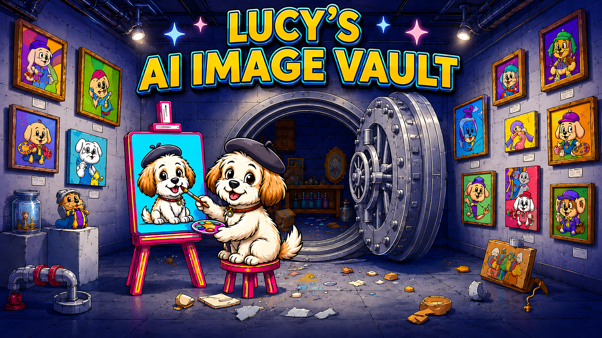

# Lucy's AI Image Vault
**Version:** 1.0

**Author:** Ed Johnson (Making With An EdJ)

**Preserve and organize your AI-generated art before Artistly deletes it.**

## Introduction

Artistly.ai automatically deletes designs from your personal library after one year — there's even a persistent warning banner in the app. If you've been creating AI art on Artistly, your older work is at risk of being permanently lost with no recovery option.

**Lucy's AI Image Vault** is a free desktop app that solves this. It connects to your Artistly account, syncs your entire design library to your local machine at full resolution, and keeps everything organized in a fast, searchable gallery — yours to keep, regardless of what happens to the cloud.

## Features

- **Automated Cloud Sync** — One-click sync via Playwright network interception. Choose Quick Sync (~128 newest designs) or Full Audit (entire library with deletion reconciliation). Configurable page counts, scoped downloads, page-range targeted downloads, and a metadata-only mode for large first-time imports.
- **Local Gallery Browser** — Filter by folder, tool, style, favorites, download state, or free-text search. Designs are grouped by generation session under shared headers.
- **Inspection Workbench** — Click any image for a full-screen view with its prompt, metadata, dimensions, and action buttons.
- **Archive Tab** — Designs deleted from Artistly remain in your local archive, fully browsable, searchable, and exportable.
- **Pending Actions** — Review all designs flagged for move, delete, or ZIP export in a single queue before executing.
- **Bulk Operations** — Flag designs in the gallery, then execute targeted or sequential bulk moves, deletes, or ZIP exports from the Control Center.
- **Edit Metadata** — Archived images support inline editing of tool, style, category, and prompt from the Inspection Workbench.
- **Prompt Library** — Searchable, filterable table of every generation prompt in your archive with inline thumbnail previews.
- **Gallery Backup** — One-click backup of your full local archive — images and database — to any folder or external drive.
- **Add External Image** — Import non-Artistly images into your vault with auto-detected dimensions.
- **9 Themes** — Time Capsule Dark, Studio Light, Deep Space, Starbase Medical, Inkwell Comic, Newsprint Comic, Carbon Fiber Maker, Birch Plywood Maker, and Purple Paradise.
- **Flexible Storage** — System Default, Documents folder, or Portable mode (alongside the `.exe`/`.app`) — chosen once on first launch.

## Installation

### Windows

1. **Download:** Download the latest `LucysVault-Windows-v1.0.zip` from the Releases page and extract it. The ZIP contains a `Lucys_Vault` folder — move it to wherever you'd like to keep the application.
2. **Run:** Open the `Lucys_Vault` folder and double-click `LucysVault.exe`.
3. **First Run:** Choose a storage location for your library — System Default (`%APPDATA%\LucysVault`), Documents (`~/Documents/LucysVault`), or Portable (alongside the `.exe`). This setting is permanent.

> **Note:** Windows Defender SmartScreen may show a warning the first time since the app is not code-signed. Click **More info → Run anyway** to proceed.

### macOS

1. **Download:** Download the latest `LucysVault-Mac-v1.0.dmg` from the Releases page.
2. **Open the DMG:** Double-click the `.dmg` file to mount it. A Finder window opens showing the `Lucys_Vault` folder.
3. **Install:** Drag the `Lucys_Vault` folder to your Desktop, Applications folder, or wherever you'd like to keep it.
4. **Eject:** Drag the mounted disk image from your Desktop or Finder sidebar to Trash, or right-click and choose **Eject**.
5. **First Launch:** Open the `Lucys_Vault` folder, right-click (or Control-click) `LucysVault.app`, choose **Open**, then click **Open** in the Gatekeeper dialog. This step is only required once.
6. **First Run:** Choose a storage location for your library on the setup screen.

> **Note:** The macOS build bundles its own Chromium browser for cloud sync automation. This makes the download significantly larger than the Windows version, but no additional browser installation is required.

> **macOS App Management Permission:** On first use of any cloud sync feature (Quick Sync, Full Audit, Bulk Move, Bulk Delete), macOS will ask for **App Management** permission. This is required because the app manages its bundled browser processes. Grant it in **System Settings → Privacy & Security → App Management**.

## Using Lucy's AI Image Vault

### Cloud Sync
The Cloud Sync card in the Control Center connects to your Artistly browser session and syncs your library in one click.

* **Quick Sync:** Fetches the most recent ~128 designs and downloads any missing images — ideal for routine use.
* **Full Audit:** Fetches your entire Artistly library, reconciling deletions and marking removed designs as archived (may take several minutes for large collections).
* **Skip Image Download:** Check this box to sync metadata only, then batch the image downloads separately via the Image Downloads card. Useful for large first-time imports.

### Gallery Browser
Browse your archive with live filtering by folder, tool, style, favorite status, downloaded state, and free-text search. Designs are grouped by generation session (same prompt, close in time) under shared headers.

* **Zoom Modal:** Click any image to open it full-screen with its prompt, metadata, and action buttons.
* **Edit Metadata:** Archived images can have their tool, style, category, and prompt edited inline from the Zoom Modal.
* **Open / Copy As:** Open an image in your preferred viewer, or copy it full-resolution to any folder with an optional rename.
* **Archive Tab:** Designs deleted from Artistly cloud remain in your local archive — fully browsable, searchable, and exportable.
* **Pending Actions:** A built-in view that collects all designs flagged for move, delete, or ZIP export in one place for review before executing.

### Bulk Operations
Flag designs in the gallery, then execute batch actions from the Control Center:

* **Targeted Move / Delete:** Fast processing for designs with a generation prompt, using Artistly's search filter.
* **Sequential Move / Delete:** Page-by-page processing for no-prompt designs.
* **ZIP Export:** Export all flagged images as a ZIP to any local folder.

### Prompt Library
A searchable, filterable table of every generation prompt across your archived library. Filter by folder, tool, or style to find prompts from a specific workflow, and hover any row to see an inline thumbnail preview of the associated design.

## Tech Stack

For the fellow coders and makers out there, here is how Lucy's AI Image Vault was built:

* **Language:** Python 3.x (FastAPI, Uvicorn, Playwright, pywebview, SQLite)
* **Interface:** React 18 SPA served from a single `index.html` — no Node.js or build step; JSX transpiled in-browser via Babel CDN; styled with Tailwind CSS
* **Data Storage:** SQLite database + local image files; three configurable storage locations (System Default, Documents, Portable)
* **Cloud Automation:** Playwright (Chromium) for network interception of Artistly's API responses and browser-based bulk operations

## Acknowledgements & Credits

* **Developer:** Ed Johnson ([Making With An EdJ](https://www.youtube.com/@makingwithanedj))
* **AI Assistance:** Developed with coding assistance from Google's Gemini 3.1 Pro model (gemini.google.com) and Anthropic's Claude (claude.ai/code).
* **Lucy (The Cavachon Puppy):**
***Chief Wellness Officer & Director of Mandatory Breaks***
    * Thank you for ensuring I maintained healthy circulation by interrupting my deep coding sessions with urgent requests for play.
* **License:** Creative Commons Attribution-NonCommercial-ShareAlike 4.0 International License.

---

## ❤️ Support the Maker (and Lucy!)

I develop these tools to improve my own workflows and love sharing them with the community. If you find Lucy's AI Image Vault useful and want to say thanks, feel free to **[buy Lucy a dog treat on Ko-fi](https://ko-fi.com/makingwithanedj)**!

***

*Happy Making!*
*— EdJ*
